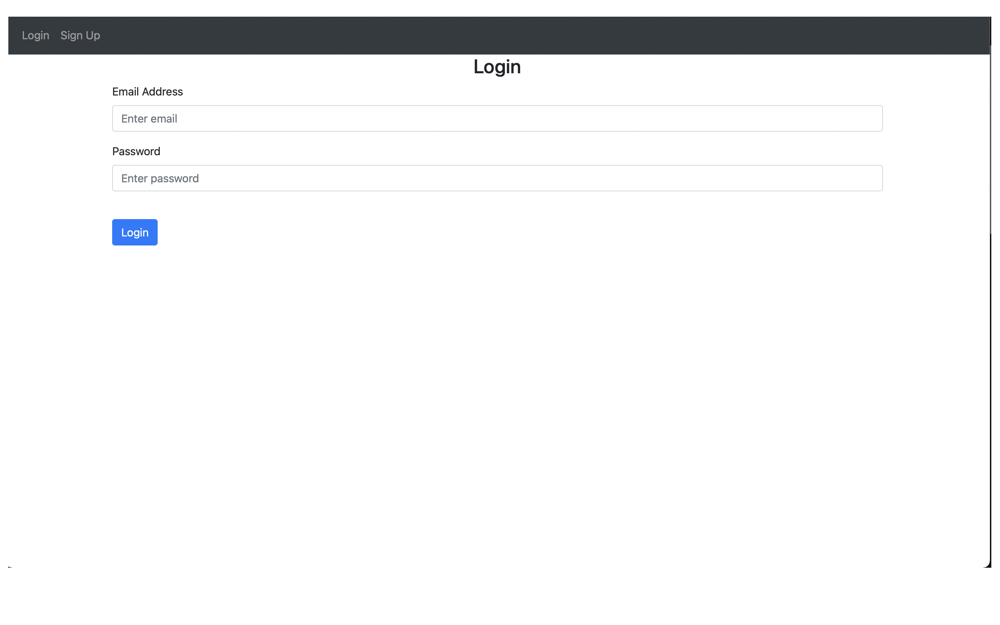
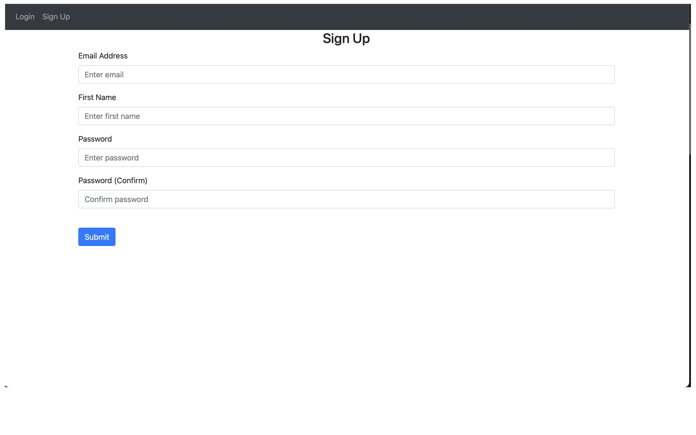
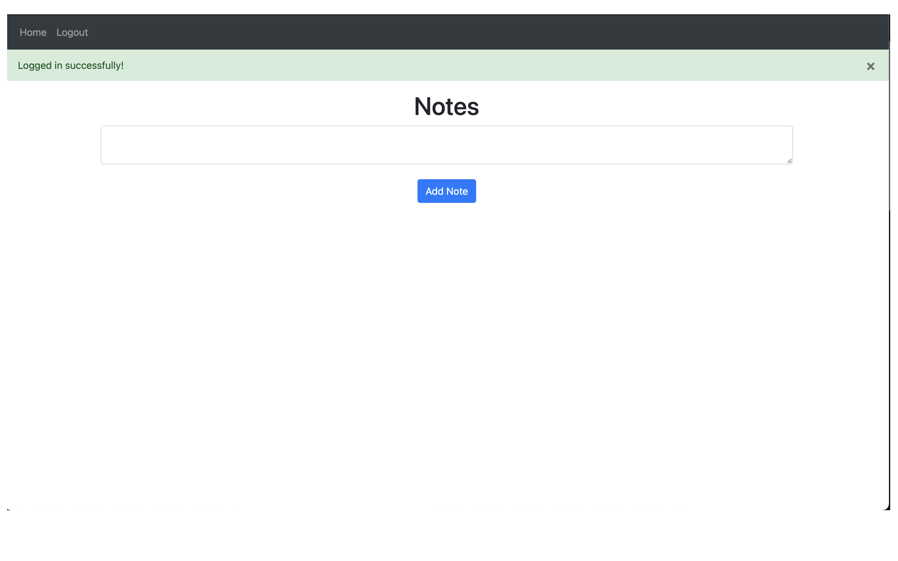

# Building website with **Python** and **Flask**

# Sections

- [Technologies Used](#technologies-used)
- [Page Layouts](#page-layout)

## Technologies used
- We will be using flask to build the website.
- We are using jinja for building templates
- We will be using python language.

[Back to top](#building-website-with-python-and-flask)
## Page Layouts
- 
- 
- 

[Back to top](#building-website-with-python-and-flask)